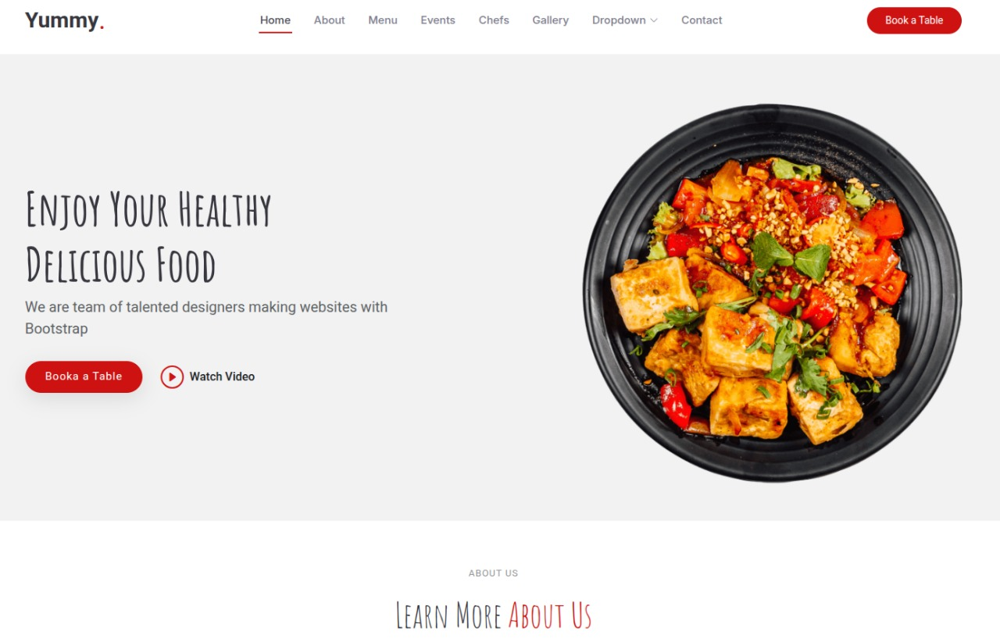

# assignment_1

## Introduction

This assignment focuses on creating a simple web page using HTML and CSS. The page to be created looks like the image attached below:



## Getting Started

### Prerequisites

- Git

- A text editor (e.g., Visual Studio Code)

- A web browser (e.g., Google Chrome)

- A live server extension (e.g., Live Server)

### Installation

1. Clone the repository:

   ```bash
   git clone https://github.com/johneliud/emobilis-bootcamp.git
   ```

2. Navigate to the project directory:
   ```bash
   cd emobilis-bootcamp && cd assignment_1
   ```

## Running The Program

- Open the `index.html` file located in the templates directory and use live server to preview the page.

- Alternatively, you can use a local web server to preview the page. Navigate to the project directory from your device and open the `index.html` file in your browser.

## Contributions

Contributions are welcome! Please follow these steps:

1. Fork the repository.

2. Create a new branch for your feature or bug fix.

3. Make your changes and commit them.

4. Push your changes to your forked repository.

5. Submit a pull request.
